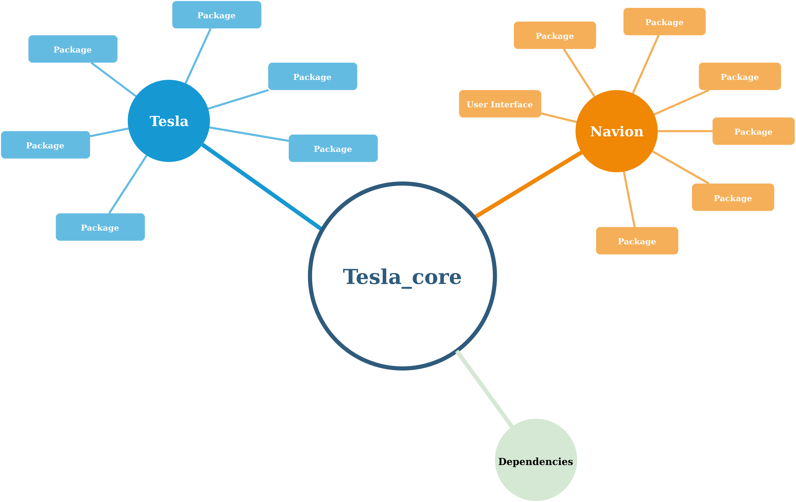

# Coding Guidelines for the Tesla_core Repository

## Guidelines

### 1. Don't fork

As a developer of the Tesla\_core team, don't fork this repository. Working in
branches instead of forks improves the overview of the project since everybody
knows what you're working on.

### 2. Work in branches

The master branch is our stable, productive branch. It should always be clean
and changes to the master without pull request are forbidden.  To add new
features, work in a branch named `feature/my_feature` or to add fixes, name it
`fix/my_fix` etc.  Naming should always be clear for other team members.  Add a
branch and make a pull request for each new feature to keep reviewing simple.
Delete unused branches, e.g., after merging with master.

### 3. Make pull requests

Make pull requests for every new feature on regular basis. Try to keep it below
500 lines of new code. You can even make a pull request and continue working on
the branch.

### 4. Code review

Pull requests always need to be reviewed by at least one person of the team
before merging to master. To make our code better and learn from the others,
       feel free to review code on your own initiative and even correct small
       things, like spelling mistakes, if you find them.

During review, also test if code is compiling and running.

### 5. Hold to Google C++ style guide

It makes work easier if we try to hold to a similar style guide. The [Google C++
Style Guide](https://google.github.io/styleguide/cppguide.html) is a good
starting point.

### 6. Formatting / Linting

Formatting is an important part of readability of the code and we should use a
uniform format.

When a new pull request to the master is made, several linters will go
through the code and check for style errors. The results are showed in
the checks tab of the PR. Right now, we run the following linters:

* [cpplint](https://github.com/cpplint/cpplint) for checking c++ code
* [black](https://pypi.org/project/black/) for Python
* [flake8](https://flake8.pycqa.org/en/latest/) for Python
* [yamllint](https://yamllint.readthedocs.io/en/stable/) for Yaml
* [hadolint](https://github.com/hadolint/hadolint) for Docker
* [markdownlint](https://github.com/DavidAnson/markdownlint) For markdown files

You can manually launch the linting checks by going in the Actions tab,
clicking on "Lint Code Base" and clicking on "Run Action". See [here](
https://docs.github.com/en/actions/managing-workflow-runs/manually-running-a-workflow)
for more info.

### 7. Use Catkin Command Line Tools

Use the Catkin Command Line Tools (catkin build instead of catkin_make) to
compile your catkin workspace.

## Structure

### Repository Structure

All repositories are built around the `Tesla_core` repository, which contains
the stable core packages not specific to any device.  `Tesla` is the research
repository which is not reviewed according to our guidelines, e.g., for student
work, testing etc.  `Navion` is separated and needs a thorough review (same for
        `Tesla_core`). `Navion` depends on `Tesla_core` and can be used with
tools from `Tesla` for development reasons.

External packages without any changes are not included in our repositories and
need to be loaded as explained in the installation instructions.
